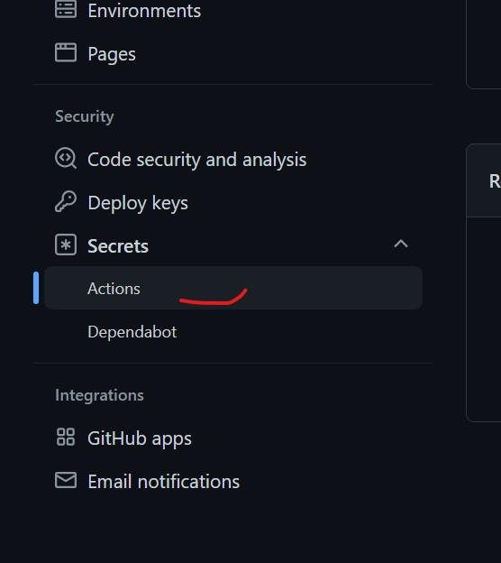
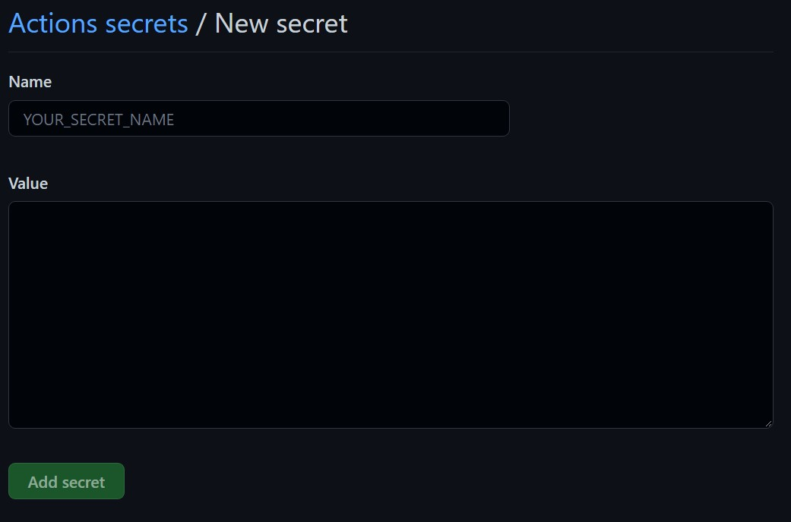
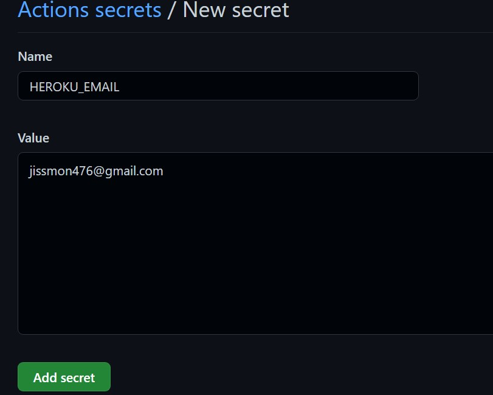
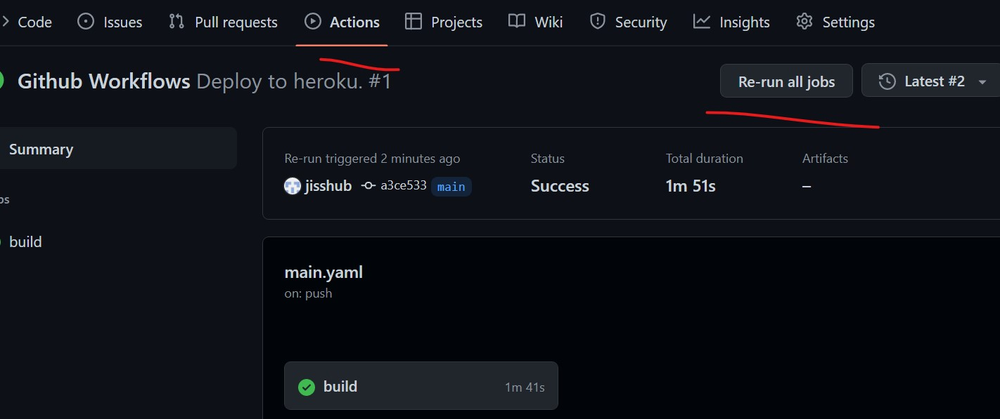

# california-housing-price-estimation

## software and account requirements

1. [Github Account](https://github.com/)
2. [Heroku Account](https://dashboard.heroku.com/)
3. [VS Code IDE](https://code.visualstudio.com/)
4. [Git CLI](https://git-scm.com/)

## create conda environment

```sh
conda create -n california-housing-price-estimation python=3.9 -y
```

## To activate this environment, Use command prompt as our shell. then type below command,

```sh
conda activate california-housing-price-estimation
```
## To deactivate an active environment, use

```sh
$ conda deactivate
```

## Create requirments.txt file

### Install packages from requirements.txt

```sh
pip install -r requirements.txt
```
### Save packages to requirements.txt file

```sh
pip freeze > requirements.txt
```
## CI/CD pipeline

To setup CI/CD pipeline in heroku, WE NEED TO GIVE BELOW INFORMATION

1. HEROKU_EMAIL = jissmon476@gmail.com
2. HEROKU_API_KEY = 4712e2b4-2f7b-4a47-b0f5-9b982b47d340
3. HEROKU_APP_NAME = housing-prediction-regression

https://dashboard.heroku.com/account

## Create a Docker File

- Install docker in our system.

Create a file name *Dockerfile* in our root folder.

* Write instructions in Dockerfile to create a Docker image.
    - Give the python version to be used inside our docker machine.
    - virtual environment not needed in our docker machine.
    - No need of git files in our docker machine, so ignore them.
    - Copy the contents to app folder in our docker machine.
    - Change working directory to app folder in our docker machine.
    - Run requirements.txt file in our docker machine.
    - Expose port number which will be sent from environment variable to our docker machine.
    - Launch our applicatioin with help of gunicorn command.

    ```dockerfile
    FROM python:3.9
    COPY . /app
    WORKDIR /app
    RUN pip install -r requirements.txt
    EXPOSE $PORT
    CMD gunicorn --worker=4 --bind 0.0.0.0:$PORT app:app 
    ```

## Build Docker Image

```sh
docker build -t <iamge-name>:<tagname> .
```

Note: Image name must be lowercase.

## To list docker image

```sh
docker images
```

## Run docker image
    
```sh
docker run -p 5000:5000 PORT:5000
```

## Check running containers in docker

```sh 
docker ps
```

## To stop docker container

```sh
docker stop <container-id>
```

## Create a github folder in root directory

- Create a folder called *workflows*.
- Create a file name *main.yaml* in *workflows* folder.

```yaml
# Your workflow name.
name: Deploy to heroku.

# Run workflow on every push to main branch.
on:
  push:
    branches: [main]

# Your workflows jobs.
jobs:
  build:
    runs-on: ubuntu-latest
    steps:
      # Check-out your repository.
      - name: Checkout
        uses: actions/checkout@v2

      ### ⬇ IMPORTANT PART ⬇ ###

      - name: Build, Push and Release a Docker container to Heroku. # Your custom step name
        uses: gonuit/heroku-docker-deploy@v1.3.3 # GitHub action name (leave it as it is).
        with:
          # Below you must provide variables for your Heroku app.

          # The email address associated with your Heroku account.
          # If you don't want to use repository secrets (which is recommended) you can do:
          # email: my.email@example.com
          email: ${{ secrets.HEROKU_EMAIL }}

          # Heroku API key associated with provided user's email.
          # Api Key is available under your Heroku account settings.
          heroku_api_key: ${{ secrets.HEROKU_API_KEY }}

          # Name of the heroku application to which the build is to be sent.
          heroku_app_name: ${{ secrets.HEROKU_APP_NAME }}

          # (Optional, default: "./")
          # Dockerfile directory.
          # For example, if you have a Dockerfile in the root of your project, leave it as follows:
          dockerfile_directory: ./

          # (Optional, default: "Dockerfile")
          # Dockerfile name.
          dockerfile_name: Dockerfile

          # (Optional, default: "")
          # Additional options of docker build command.
          docker_options: '--no-cache'

          # (Optional, default: "web")
          # Select the process type for which you want the docker container to be uploaded.
          # By default, this argument is set to "web".
          # For more information look at https://devcenter.heroku.com/articles/process-model
          process_type: web
### ⬆ IMPORTANT PART ⬆ ###
```

### What does this yaml does ?

- Here we trigger the deployment of our docker image to heroku.
- Whenever we push to main branch, it is gonna create a trigger.
- Then build a docker image and push it to heroku.
- We use github action here.
- Here we supply heroku email id, api key, app name, docker file directory and docker file name.
- We also supply additional options of docker build command.
- We also supply process type.
- Workflow runs on every push to main branch.
- Work flow runs in latest ubuntu.

Time: 2:23:00


## Remote Repository of Project

- Open github remote repo.
- Navigate to settings
- Choose Actions from Secrets



- Then create new repository secret.



- Choose heroku email as secret name.
- Then enter your heroku email id as value.



- Then click Add Secret button.
- Similary create another secret for **HEROKU_API_KEY** and **HEROKU_APP_NAME**.
- Then move to Actions tab.
- Click the workflow.
- Rerun all jobs.



- Here build is succesful and we have our docker image deployed to heroku.

 
Github Actions Documentation - https://docs.github.com/en/actions


